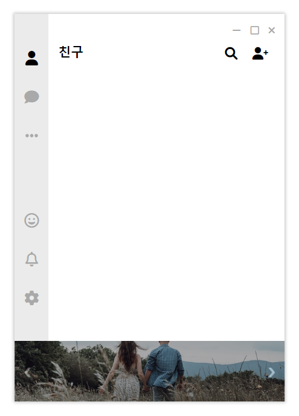
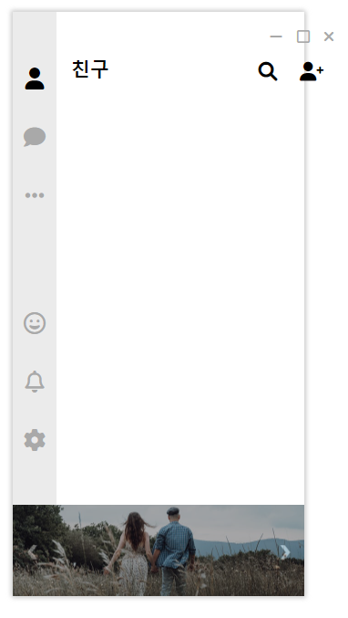

# Clone KakaoTalk

PC 카카오톡의 생김새를 보고 웹 프로그래밍으로 만들어 보자.

Clone코딩이 너무나도 많은데 강의를 보고 만드는 것이 아니라 자체적으로 진행.

참고 내용은 오직 구글링...(clone 코딩 내용 제외)

## issue

크기가 너무 줄어들면 `flex` 형식과 `block` 차이에서 생기는 이러한 현상이 나옴.

해당 부분은 main 영역에 해당하기에 기획과 구상을 더 한 후에 진행할 것.